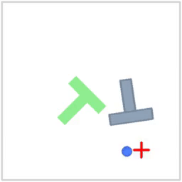
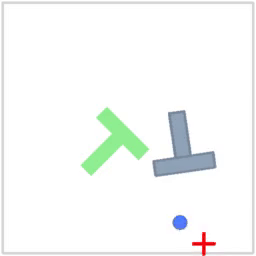
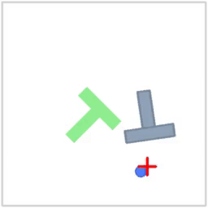

# Imitation Learning with Flow Matching and Score Matching

I train action chunking policies for the Push-T environment:
- a
simple MSE (mean-squared error) policy that predicts action chunks in a single forward pass
- a flow matching policy
- a score matching policy

## Action Chunking
Action chunking reduces decision frequency by predicting a short horizon of actions at once. At time $ t $, the policy $ \pi_\theta(\mathbf{A}_t | \mathbf{o}_t) $ maps the current observation $ \mathbf{o}_t $ to an action chunk $ \mathbf{A}_t = (\mathbf{a}_t, \mathbf{a}_{t+1}, \dots, \mathbf{a}_{t+K-1}) $ for some fixed chunk length $ K $. The chunk is executed open-loop: the environment receives $ \mathbf{a}_t $ at time $ t $, then $ \mathbf{a}_{t+1} $ at time $ t + 1 $, and so on until $ \mathbf{a}_{t+K-1} $. After the chunk finishes, the policy is queried again on the latest observation $ \mathbf{o}_{t+K} $ to produce the next chunk.

## Policies
### mean-squared error
The simplest way to train an action chunking policy is to use a mean-squared error (MSE) loss. That is, given a dataset of paired observations and expert chunks $(\mathbf{o}_t^{(j)}, \mathbf{A}_t^{(j)})$, we fit $\pi_\theta$ by minimizing

$$ \mathcal{L}_{\text{MSE}}(\theta) = \frac{1}{B} \sum_{j=1}^B \left\| \mathbf{A}_t^{(j)} - \pi_\theta(\mathbf{o}_t^{(j)}) \right\|_2^2$$

for each batch, where $\pi_\theta(\mathbf{o}_t^{(j)})$ denotes the output of the policy network, and $B$ is the batch size.

### flow matching
Let $\mathbf{A}_t^{(j)}$ be an action chunk and $\mathbf{A}_{t,0}^{(j)} \sim \mathcal{N}(0, I)$ be noise of the same shape. We first sample a “flow matching timestep” $\tau^{(j)} \sim \mathcal{U}(0,1)$ and define the interpolation $\mathbf{A}_{t,\tau}^{(j)} = \tau^{(j)}\mathbf{A}_t^{(j)} + (1 - \tau^{(j)})\mathbf{A}_{t,0}^{(j)}$. We then train a network $v_\theta$ to predict the velocity that moves $\mathbf{A}_{t,\tau}^{(j)}$ toward $\mathbf{A}_t^{(j)}$, using the flow-matching loss

$$
\mathcal{L}_{\text{FM}}(\theta) = \frac{1}{B} \sum_{j=1}^B \left\| v_\theta(\mathbf{o}_t^{(j)}, \mathbf{A}_{t,\tau}^{(j)}, \tau^{(j)}) - (\mathbf{A}_t^{(j)} - \mathbf{A}_{t,0}^{(j)}) \right\|_2^2. 
$$

At inference time, we sample initial noise $\mathbf{A}_{t,0} \sim \mathcal{N}(0, I)$ and integrate the ODE $\frac{d\mathbf{A}_{t,\tau}}{d\tau} = v_\theta(\mathbf{o}_t, \mathbf{A}_{t,\tau}, \tau)$ from $\tau=0$ to $\tau=1$. The simplest integration method is Euler integration, which is given by the following update rule:

$$
\mathbf{A}_{t,\tau + \frac{1}{n}} = \mathbf{A}_{t,\tau} + \frac{1}{n} \cdot v_\theta(\mathbf{o}_t, \mathbf{A}_{t,\tau}, \tau),
$$

which is repeated $n$ times from $\tau=0$ to $\tau=1$ to obtain $\mathbf{A}_{t,1}$, where $n$ is the number of integration steps (also called “denoising steps”). $\mathbf{A}_{t,1} = \mathbf{A}_t$ is the final action chunk that is executed open-loop, as before.

### score matching
Like flow matching, we train a neural network $v_\theta$ to approximate the vector field using the loss

$$
\mathcal{L}_{\text{SM}}(\theta) = \frac{1}{B} \sum_{j=1}^B \left\| v_\theta(\mathbf{o}_t^{(j)}, \mathbf{A}_{t,\tau}^{(j)}, \tau^{(j)}) - (\mathbf{A}_t^{(j)} - \mathbf{A}_{t,0}^{(j)}) \right\|_2^2.
$$

At inference time, we use the score matching stochastic differential equation (SDE). Starting from initial noise $\mathbf{A}_{t,0} \sim \mathcal{N}(0, I)$, we iteratively update by first computing the score from the velocity field:

$$
s_\theta(\mathbf{A}_{t,\tau}, \tau) = \frac{\tau \cdot v_\theta(\mathbf{o}_t, \mathbf{A}_{t,\tau}, \tau) - \mathbf{A}_{t,\tau}}{1 - \tau},
$$

then applying the SDE update with noise level $\sigma$:

$$
\mathbf{A}_{t,\tau + \Delta \tau} = \mathbf{A}_{t,\tau} + \left( v_\theta(\mathbf{o}_t, \mathbf{A}_{t,\tau}, \tau) + \frac{1}{2} \sigma^2 s_\theta(\mathbf{A}_{t,\tau}, \tau) \right) \Delta \tau + \sigma \sqrt{\Delta \tau} \boldsymbol{\epsilon},
$$

where $\boldsymbol{\epsilon} \sim \mathcal{N}(0, I)$. After $n$ steps from $\tau=0$ to $\tau=1$, we obtain the final action chunk $\mathbf{A}_{t,1} = \mathbf{A}_t$.

## Neural Network Architecture

All policies use a feedforward neural network (MLP) with the following structure:

- **MSE Policy**: Takes the observation $\mathbf{o}_t$ as input, with input dimension equal to the state dimension.
- **Flow Matching / Score Matching Policies**: Take a concatenated input of $[\mathbf{o}_t, \mathbf{A}_{t,\tau}, \tau]$, where $\mathbf{A}_{t,\tau}$ is the interpolated/noisy action chunk and $\tau$ is the timestep. The input dimension is therefore $\text{state_dim} + \text{chunk_size} \times \text{action_dim} + 1$.

All networks consist of:
- Hidden layers with SiLU activation functions
- Output layer with no activation (linear output)
- Output dimension equal to $\text{chunk_size} \times \text{action_dim}$, reshaped to $(\text{chunk_size}, \text{action_dim})$

**Default hyperparameters**:
- Hidden dimensions: $(256, 256, 256)$ (three hidden layers of 256 units each)
- Chunk size: 8

## Evaluation
I evaluate the policies in the gym_pusht/PushT-v0 Gymnasium environment.

The reward is the coverage of the block in the goal zone. The reward is 1.0 if the block is fully in the goal zone. 

Below are visualizations of the trained policies executing the Push-T task:

| Policy | GIF | Mean Reward |
|--------|-----|-------------|
| MSE |  | 0.56163 |
| Flow Matching |  | 0.83549 |
| Score Matching ($\sigma=1$) |  | 0.32954 |
| Score Matching ($\sigma=0.1$) |  | 0.81352 |

## Setup

This project uses `uv` for package management. `uv` is a Python package and environment manager from [Astral](https://astral.sh). It replaces tools like
`pip`, `pipx`, `conda`, and `virtualenv` with a single, simple interface. It is also much faster than prior tools.

### Installing `uv`

Run the following in your terminal:

```bash
curl -LsSf https://astral.sh/uv/install.sh | sh
```

After installation, open a new terminal so `uv` is on your `PATH`.

### Always use `uv run`

Do **not** run `python` or `pip` directly. Always run scripts through `uv run` so dependencies
and environments are handled automatically. If you want to add a new dependency, you can use `uv add`. This will add the dependency to `pyproject.toml`, update `uv.lock`, and install the package into your virtual environment.

Example:

```bash
uv run src/hw1_imitation/train.py --help
```


## Weights & Biases (wandb) login

These assignments use [Weights & Biases (WandB)](https://wandb.ai) for experiment tracking. WandB is a tool for logging and visualizing machine learning experiments. It is free for academic use. Before running a training script, you will need to log in to WandB using your API key.

```bash
uv run wandb login
```

Follow the prompt to paste your API key.

## Using Modal

**Note that Modal is likely not necessary for this assignment. In testing, training was much faster on a local laptop CPU than on Modal. However, you may need to use Modal in future assignments, so if you want to get set up, here are the instructions:**

First, create a Modal account. You should recieve $30 in free credits, which will be plenty for this assignment. Then, you can train on Modal with the following command:

```bash
uv run modal run src/hw1_imitation/modal_train.py
```

This will build a Modal container and launch training remotely. You can pass the same flags as the local training script. If you are logged into WandB locally, your API key will be automatically forwarded to the Modal container.

Logs and checkpoints will be saved to a Modal volume called `hw1-imitation-volume`. To inspect the logs, you can use:

```bash
uv run modal volume ls hw1-imitation-volume exp
```

Then, you can download the logs and checkpoints to your local machine using a command like the following:

```bash
uv run modal volume get hw1-imitation-volume exp/<experiment_name>
```

## References
This repository is built on

https://github.com/berkeleydeeprlcourse/homework_spring2026/tree/main/hw1

https://github.com/tbanker/cs285/tree/main/hw1

